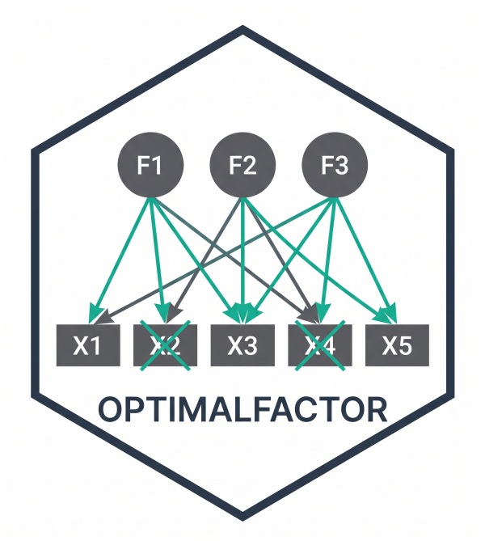

# OptimalFactor



A comprehensive package for optimal factor model refinement in both EFA
and CFA using machine-learning inspired boosting algorithms.  
[**Visit the author’s website**](https://joseventuraleon.com/)  
  

[](https://jventural.github.io/OptimalFactor/)

## Features

- **EFA-Boosting Algorithm**: Advanced iterative optimization for
  Exploratory Factor Analysis
- **Adaptive Fit Indices**: Dynamic weights based on df x N following
  Kenny, Shi & Savalei (2022)
- **Automatic Problem Detection**: Heywood cases, cross-loadings, and
  low loadings
- **Global Search**: Multi-item removal optimization
- **AI Integration**: Optional GPT-powered conceptual analysis of
  removed items
- **Interactive Shiny App**: EFA-Boosting Studio for user-friendly EFA
  optimization
- **Specification Search (CFA)**: Heuristic hill-climbing over seed
  configurations following MacCallum (1986), with move / drop / cov
  operations and optional bifactor variant

## Installation

You can install the latest version of OptimalFactor from GitHub:

``` r

if (!require("devtools")) {
  install.packages("devtools")
}
devtools::install_github("jventural/OptimalFactor")
```

## Quick Start

### EFA-Boosting

``` r

library(OptimalFactor)

result <- efa_boosting(
  data = your_data,
  name_items = "item",
  n_factors = 3,
  verbose = TRUE
)
```

### EFA-Boosting Studio (Shiny App)

``` r

library(OptimalFactor)
run_efa_boosting()
```

## Main Functions

| Function | Description |
|----|----|
| [`efa_boosting()`](https://jventural.github.io/OptimalFactor/reference/efa_boosting.md) | EFA optimization with adaptive composite fit |
| [`run_efa_boosting()`](https://jventural.github.io/OptimalFactor/reference/run_efa_boosting.md) | Launch EFA-Boosting Studio (Shiny app) |
| [`cfa_boosting()`](https://jventural.github.io/OptimalFactor/reference/cfa_boosting.md) | CFA optimization with modification indices |
| [`specification_search()`](https://jventural.github.io/OptimalFactor/reference/specification_search.md) | Heuristic CFA specification search (MacCallum, 1986) |
| [`print_conceptual_analysis()`](https://jventural.github.io/OptimalFactor/reference/print_conceptual_analysis.md) | Display AI-generated item analyses |

### Specification Search (CFA)

[`specification_search()`](https://jventural.github.io/OptimalFactor/reference/specification_search.md)
runs a heuristic hill-climbing search over CFA model configurations in
the spirit of MacCallum (1986). For each seed (a candidate number of
factors with an initial item-to-factor assignment) the algorithm
iteratively tries three local operations and keeps the change with the
lowest composite loss:

- **move** an item from its current factor to another;
- **drop** an item with low loading or causing strain;
- **cov** add a residual covariance suggested by modification indices.

A bifactor variant (one orthogonal general factor plus the configured
group factors) can be tried automatically for every seed with k \>= 2.
The procedure returns every model evaluated, the subset that meets the
user-supplied fit targets (CFI / RMSEA), and the best model under a
composite loss.

``` r

library(lavaan)
library(OptimalFactor)

# Simulated 3-factor data
sim <- '
  F1 =~ 0.75*x1 + 0.70*x2 + 0.65*x3
  F2 =~ 0.75*x4 + 0.70*x5 + 0.65*x6
  F3 =~ 0.75*x7 + 0.70*x8 + 0.65*x9
  F1 ~~ 0.30*F2 + 0.30*F3
  F2 ~~ 0.30*F3
'
df    <- simulateData(sim, sample.nobs = 500, seed = 2026)
items <- paste0("x", 1:9)

res <- specification_search(
  data         = df,
  items        = items,
  max_factors  = 4,
  estimator    = "ML",
  ordered      = FALSE,
  try_bifactor = TRUE,
  verbose      = TRUE
)

print(res, top = 8)         # ranking by composite loss
res$successful              # configurations meeting CFI / RMSEA targets
summary(res$best$fit)       # fitted lavaan object for the best model
```

Pass your own theoretically motivated seeds via the `seeds` argument:

``` r

seeds <- list(
  "3" = list(
    list(F1 = c("x1","x2","x3"),
         F2 = c("x4","x5","x6"),
         F3 = c("x7","x8","x9"))
  )
)
specification_search(data = df, items = items, seeds = seeds,
                     estimator = "ML", ordered = FALSE,
                     try_bifactor = FALSE)
```

A complete runnable script is available at
[`examples/example_specification_search.R`](https://jventural.github.io/OptimalFactor/examples/example_specification_search.R).

**Important caveat — MacCallum (1986).** Specification search
capitalizes on chance. Use it as an **exploratory** device only and:

1.  Report the procedure transparently as exploratory.
2.  Cross-validate the resulting model with an independent sample or via
    bootstrap.
3.  Justify every accepted modification on substantive theoretical
    grounds.

The function prints this warning at the start of every run (suppress
with `verbose = FALSE`).

## Examples

[Basic tutorial of the R OptimalFactor
library](https://rpubs.com/jventural/OptimalFactor)

## References

- MacCallum, R. C. (1986). Specification searches in covariance
  structure modeling. *Psychological Bulletin, 100*(1), 107–120.
- Saris, W. E., Satorra, A., & van der Veld, W. M. (2009). Testing
  structural equation models or detection of misspecifications?
  *Structural Equation Modeling, 16*(4), 561–582.
- Kenny, D. A., Shi, D., & Savalei, V. (2022). Improvements in the
  goodness of fit assessment for confirmatory factor analysis.
  *Psychological Methods*.

## License

GPL-3

## Citation

Ventura-Leon, J. (2026). *OptimalFactor: Optimal Factor Analysis with
EFA-Boosting Algorithm* \[R package\]. GitHub.
<https://github.com/jventural/OptimalFactor>

## Author

Jose Ventura-Leon <jventuraleon@gmail.com>
